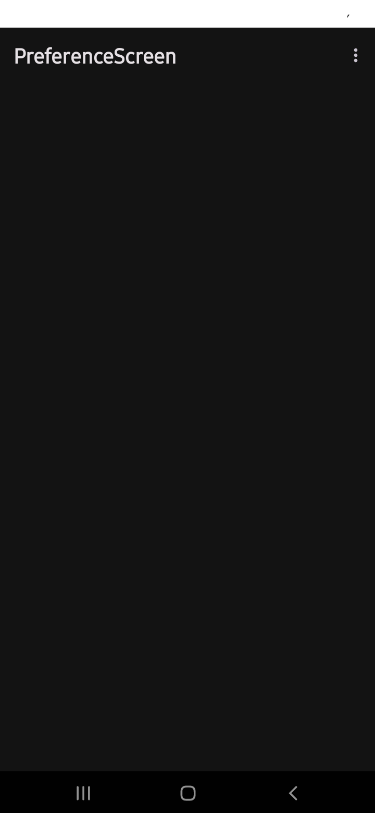
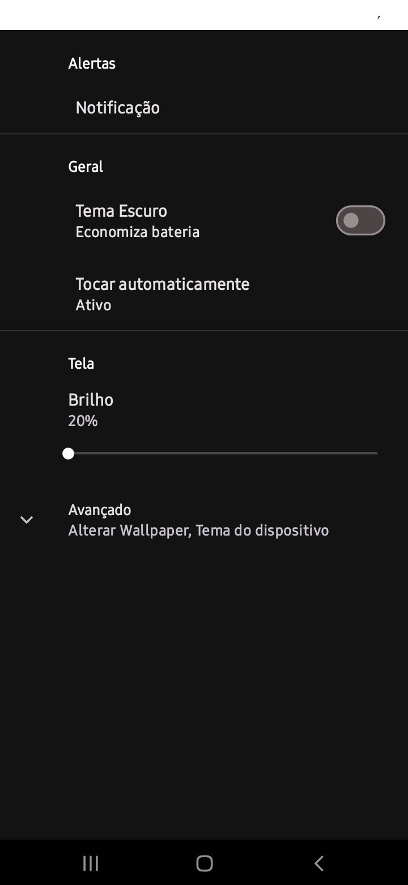
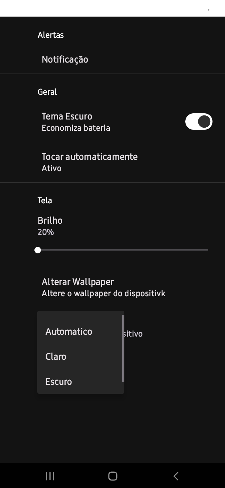

# PreferenceScreen
<h1>About this app</h1>

   
   
   
   

This application is example of SettingsScreen (PreferenceScreen) with material design 3

Is free to use

<a href="https://github.com/aquilesTrindade">Cretor</a>
